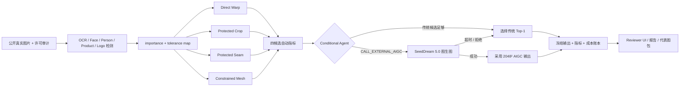
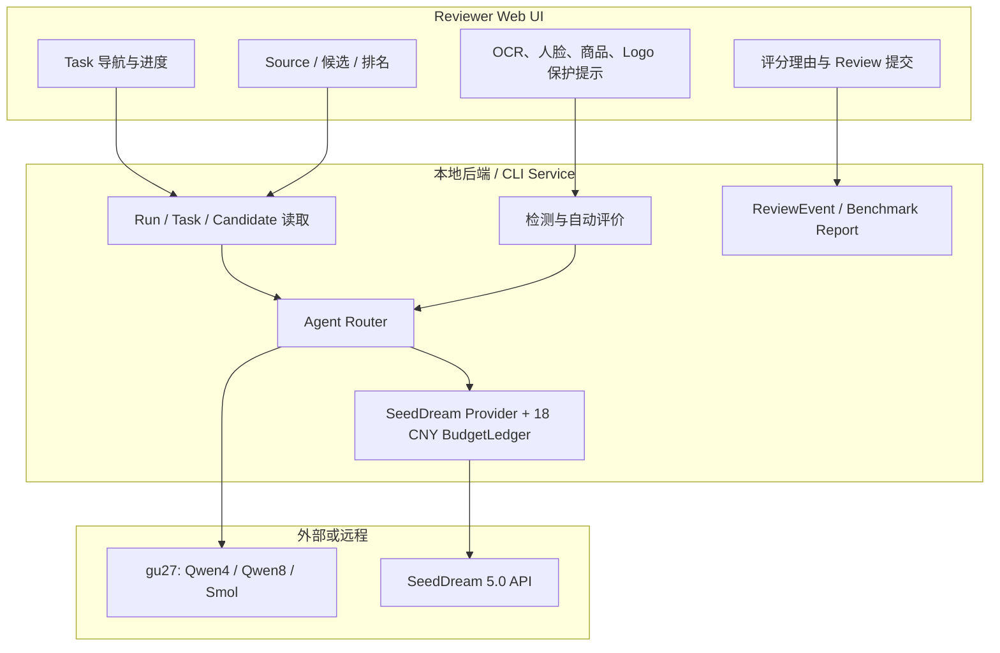

# Retarget Agent：AIGC30 质量、效率与 API 成本报告

> Run：`aigc30-seedream5-v3-20260812`
> Benchmark：`retarget_square_aigc30_v1`
> 日期：2026-08-12
> 目标：统一 `1024×1024`（1:1）
> 外部模型：`doubao-seedream-5-0-pro-260628`
> 口径：公司内部提供 Agent 推理，Agent token 成本按 0 元；只计算 AIGC API 成本。

## 1. 执行结论

这轮已经补齐了此前缺失的“纯 AIGC 实际调用”证据。30 张公开、许可证可审计的困难图片全部获得终态：SeedDream 成功返回 21 张，8 张超时，1 张因输入约束被拒绝；没有为提高成功率而重试失败项。纯 AIGC 的输出成功率为 **70.0%**，成功输出自动质量均分为 **73.88**，但把 9 个失败计入完整 30 张分母后，Proxy Success 只有 **53.3%**。

最优的成本—质量折中是 **Qwen3-VL-4B Conditional Agent + SeedDream + 传统回退**：

- 30 张中只对 17 张请求 AIGC，而不是全部 30 张；
- 17 次中 10 张 AIGC 成功，7 张失败后自动回退到 Qwen4 选出的传统候选；
- 完整 30 张 Proxy Success 为 **70.0%**；
- 自动质量均分为 **66.33**；
- AIGC API 估算成本为 **4.80–9.60 元**；
- 单个 Proxy Success 的 API 成本为 **0.229–0.457 元**；
- Agent 观察到 159,176 tokens，但在本报告的公司内部场景中成本记为 **0 元**。

纯 AIGC 虽然在“已经生成成功”的样本上分数最高，但失败率、约 2 分钟单图延迟和白底居中保守构图，使其不适合不带回退地直接上线。Hybrid 的核心收益不是让每一张图的自动分达到最高，而是以更少 API 调用换取更高的完整分母成功率。

## 2. 本轮到底测了什么

### 2.1 冻结的 30 张测试集

从 `retarget_square_public_v2` 的 300 张完整公开集里冻结 30 张。选择优先级是：

1. 纳入 Qwen4 判定为 `CALL_EXTERNAL_AIGC` 的困难项；
2. 覆盖全部 7 个真实场景；
3. 优先 `aspect_extreme`、`aspect_hard_2`；
4. 优先传统方法最高分仍低、方法间分歧大的样本。

场景配额为 5/4/4/4/4/4/5：中文密集海报 5、单商品 4、多商品商业图 4、多人 4、肖像 4、风景建筑 4、复杂混合 5。难度为 `hard1=5`、`hard2=8`、`extreme=17`。30/30 均为公开真实图片，许可证、来源、作者/署名、像素 SHA256 和内容安全状态均在 `aigc30_source_audit.csv` 中冻结。

原 Full300 的 `api_egress_allowed` 字段没有被篡改。本轮使用用户于 2026-08-12 对 AIGC30 的明确授权，另行记录 `egress_authorization=user_explicit_2026-08-12_aigc30`。

### 2.2 比较路线

本轮在同一组 30 张上比较 11 条路线：

1. `direct_warp`：直接将原图非等比缩放为正方形；最快，但人物、圆形商品和建筑比例容易失真。
2. `crop`：保护区域参与选窗的覆盖式裁切；不拉伸，但极端长宽比会丢失两端信息。
3. `seam`：使用 importance/tolerance map 的保护性接缝移除，再进行显式最终尺寸对齐；速度最慢的传统方法，受 seam budget 限制。
4. `mesh`：importance-weighted rectilinear mesh；试图把变形分配到低重要区域，同时记录 anisotropy 与 foldover 风险。
5. `technical_top1`：生成四个候选后按固定技术风险选择，不使用 Agent。
6. `rules_router`：基于分数、级别和风险码的确定性规则路由，不使用模型 token。
7. `qwen4_conditional`：只有规则认为候选不确定时才调用 Qwen3-VL-4B，模型审阅四个匿名候选并返回严格 JSON 排名与外部生成建议。
8. `qwen8_conditional`：与 Qwen4 同一 insertion point、同一 Schema，模型换为 Qwen3-VL-8B。
9. `smol_conditional`：使用 SmolVLM2-2.2B；持久化 Schema 失败会安全回退。
10. `pure_seedream5`：30 张全部直接调用 SeedDream 5.0，不使用传统回退。
11. `qwen4_seedream5_hybrid`：先生成四个传统候选，Qwen4 动态决定是否外部生成；AIGC 成功则采用 AIGC，失败则采用 Qwen4 传统 Top-1。

## 3. 项目级数据流



## 4. 前后端与运行时边界



前端不持有 API key，也不直接访问 SeedDream。Provider 只从运行时环境读取 endpoint/key/model；缓存仅保存 source SHA256、prompt SHA256、模型和生成配置哈希，不保存密钥、Base64 原图或完整 Prompt。

## 5. SeedDream 调用链路与安全门禁

### 5.1 为什么 V1/V2 失败、V3 成功

V1 使用 Wikimedia 的公开 URL，`watermark=false`；V2 改为官方示例一致的 `watermark=true`。两次均返回 HTTP 400，且 `charge_may_have_occurred=false`。脱敏诊断得到的供应商原因为：服务端下载 Wikimedia URL 超时。

官方[图片生成 API 文档](https://api.volcengine.com/api-docs/view?action=ImageGenerations&serviceCode=ark&version=2024-01-01)声明 `image` 支持 URL 或 Base64。V3 因此改为：读取本地已审计 PNG、复核 SHA256、编码为 `data:image/png;base64,...` 后提交。Base64 只存在于请求内存，不写缓存；输入大小限制为 10 MiB。

### 5.2 幂等、预算和失败处理

- 每个 Task 只允许一个输出；
- 生成前按 0.60 元保守预留预算；
- 30 张共享 18 元硬预算；
- 成功、超时和 5xx 都冻结为不可盲重试终态；
- 明确 4xx 会释放预算并记录“不计费”；
- 4 路并发使用每 Task 独立 cache/claim，避免并发覆盖和重复请求；
- Provider 成功输出保留原始 2048×2048 JPEG，再生成独立 1024×1024 PNG 用于同口径评测。

### 5.3 固定提示词

提示词要求保留主体、人物、商品、全部中英文文字、Logo、价格、按钮、角标、人脸、手、建筑和直线；只允许重构不重要背景，并禁止翻译、改写、删除、复制、拉伸、模糊和水印。30 张使用相同 Prompt 版本 `aigc30-faithful-square-v1`，没有逐图人工改 Prompt。

## 6. 自动质量结果

| 路线 | 观察质量均分 | 完整分母 Proxy Success | Proxy A | 平均时延 | P95 时延 | AIGC 调用 | API 成本（元） |
|---|---:|---:|---:|---:|---:|---:|---:|
| Direct Warp | 56.62 | 20.0% | 3.3% | 0.20s | 0.23s | 0 | 0 |
| Crop | 57.40 | 26.7% | 3.3% | 0.20s | 0.25s | 0 | 0 |
| Seam | 57.15 | 20.0% | 6.7% | 7.18s | 9.21s | 0 | 0 |
| Mesh | 54.67 | 10.0% | 0.0% | 0.21s | 0.26s | 0 | 0 |
| Technical Top-1 | 57.93 | 26.7% | 6.7% | 7.78s | 9.84s | 0 | 0 |
| Rules Router | 59.42 | 33.3% | 6.7% | 7.78s | 9.84s | 0 | 0 |
| Qwen4 Conditional | 61.20 | 43.3% | 6.7% | 16.92s | 22.78s | 0 | 0 |
| Qwen8 Conditional | 60.58 | 40.0% | 6.7% | 15.69s | 21.21s | 0 | 0 |
| Smol Conditional | 57.59 | 30.0% | 3.3% | 12.44s | 16.89s | 0 | 0 |
| Pure SeedDream 5 | 73.88（21 张） | 53.3%（30 张） | 20.0% | 125.05s | 184.19s | 30 | 8.70–17.40 |
| **Qwen4 + SeedDream Hybrid** | **66.33（30 张）** | **70.0%** | **13.3%** | 87.88s | 198.53s | **17** | **4.80–9.60** |

解释：传统路线的时延是单方法生成时延；需要在四候选上作决策的路线计入四种方法生成总时延，再加 Agent 调用；Hybrid 还计入被触发的 AIGC 端到端时延。Pure SeedDream 的均分只在 21 张成功输出上有定义，但 Proxy Success 使用全部 30 张分母，失败任务按 Proxy C 处理。

### 6.1 场景分层

| 场景 | 任务数 | AIGC 成功 | 成功率 | 成功输出均分 |
|---|---:|---:|---:|---:|
| 中文密集海报 | 5 | 4 | 80% | 72.47 |
| 单商品宣传图 | 4 | 1 | 25% | 80.64 |
| 多商品商业图 | 4 | 3 | 75% | 78.55 |
| 多人物 | 4 | 3 | 75% | 66.57 |
| 人物肖像 | 4 | 2 | 50% | 86.30 |
| 风景/建筑/结构线 | 4 | 3 | 75% | 68.35 |
| 复杂混合 | 5 | 5 | 100% | 73.60 |

单商品成功率最低，主要是极端长宽比输入引发超时/拒绝；人物肖像成功样本质量最高，但极窄全身像一旦 AIGC 失败，传统 Direct Warp 回退会产生显著横向拉伸。

## 7. 指标含义

自动评价与 Full300 使用同一个 evaluator：

- `quality_score`：content fidelity 50%、visual integrity 30%、composition 20%；缺失的 transform safety 不按 0 分处理，而是重新归一权重。
- `OCR character recall / sequence similarity`：比较 Source 与候选 OCR 文本；旧报纸小字会受到 OCR 本身误识别影响。
- `face/person/product/logo count preservation`：完整检测套件在候选上重新运行，不使用 Source 标签代替候选检测。
- `structure_line_similarity`：约束建筑、海报边框和商品几何结构。
- `Proxy A/B/C`：尚未用独立人工金标校准；A/B 算 Proxy Success，C 算失败。

一个重要偏差是：自动指标很喜欢“把原图缩小并居中放在白色正方形画布”这种策略，因为它保住了像素、文字和结构。它对信息安全是有效方案，但可能不满足全幅商业构图，因此必须结合 Codex/人工视觉意见。

## 8. Codex 代表图抽审

从 7 个场景各取 2 张，共 14 张。抽审采用用户允许的宽松标准：主体信息表达清楚、无明显人物/商品变形、重要文字无整块缺失即可给较好分。

- 14 张平均：**72.7/100**；
- SeedDream 成功的 8 张平均：**81.0/100**；
- SeedDream 失败后的 6 张传统回退平均：**61.7/100**。

成功案例的优势是信息保真、人数/商品数量稳定和结构线自然；主要缺点是常用白边留白，复杂细字仍无法仅靠缩略图确认。代表样本 `commons-94832ce9dc9` 自动 OCR 召回只有 0.132，尽管主体和版面看起来完整，仍只能给 72/100。

完整逐图理由在 `docs/reviews/aigc30-codex-visual-review.md` 和 CSV。交付包中每张代表图是一个独立文件夹，包含：

- `00_source.png`；
- 四种传统候选，文件名直接带 Rank 和自动分；
- `05_qwen4-selected_*.png`；
- `06_seedream5_score-*.png` 或明确的失败占位图；
- `07_comparison.png`；
- `metrics-and-provenance.json`；
- 含自动理由、Codex 视觉分和中文理由的 `README.md`。

## 9. 公司内部 Agent 免费时的成本

本节严格按“Agent token 由公司内部提供，成本为 0”计算：

| 路线 | Agent tokens（观察值） | Agent 成本 | AIGC API 成本 | 每个 Proxy Success API 成本 |
|---|---:|---:|---:|---:|
| Qwen4 Conditional（不调用 AIGC） | 159,176 | 0 | 0 | 0 |
| Qwen8 Conditional（不调用 AIGC） | 102,521 | 0 | 0 | 0 |
| Smol Conditional（不调用 AIGC） | 63,606 | 0 | 0 | 0 |
| Pure SeedDream 5 | 0 | 0 | 8.70–17.40 | 0.544–1.088 |
| Qwen4 + SeedDream Hybrid | 159,176 | 0 | 4.80–9.60 | **0.229–0.457** |

SeedDream 返回不包含单图实际账单，所以 `actual_cost_cny=null`。成本范围按用户给定的 0.30–0.60 元/张计算：

- Pure：21 次成功 + 8 次超时可能计费 + 1 次明确 4xx 不计费，即 29 个 charge-risk 请求，成本 8.70–17.40 元；
- Hybrid：17 个被 Agent 触发的请求中有 16 个 charge-risk，成本 4.80–9.60 元；
- 这不是“真实扣款数字”，是可审计的保守范围。

## 10. 为什么不是“全都用 AIGC”

1. **可靠性**：纯 AIGC 9/30 没有输出；Hybrid 全部 30 张都有可交付结果。
2. **成本**：Hybrid 比 Pure 少 13 次 API 请求，估算节省 3.90–7.80 元。
3. **延迟**：成功 AIGC 单图平均 116.71 秒；传统 Direct/Crop/Mesh 约 0.2 秒，Seam 约 7.2 秒。
4. **文字风险**：生成模型可能在视觉上“像文字”，但改变字符；传统方案在不裁切时更可审计。
5. **版式质量**：AIGC 会用白边留白规避重排，保真但未必符合全幅成品要求。

因此建议生产默认策略为：低风险图片直接传统；人物比例失真、极端长宽比或传统候选低分时才请求生成；任何 AIGC 失败都回退，不在在线链路自动重试。

## 11. 文字回贴与 Flux 9B：本轮边界和下一步

本轮遵照“先测 AIGC”，**没有再花成本跑文字回贴或 Flux 9B**，不能把设计计划写成已测试结果。

已有唯一 AnyText2 远程 smoke 的真实结果是质量失败：目标中文字符召回 0，遮罩外 OCR 字符召回 0.681，遮罩外差异像素 60.35%；因此 AnyText2 目前不能进入生产路由。它不是本轮 30 张 SeedDream 的结果，也不能用旧 smoke 冒充批量评测。

下一轮建议只对以下小分母做闭环，而不是再跑完整 240：

1. 从 AIGC30 成功的 21 张中取 OCR recall 低于 0.60 或出现 `critical_text_missing` 的 8–10 张；
2. Agent 判定“文字必须逐字保持”时，走原有文字保护/回贴链路，并在回贴前后同时算 OCR recall、非文字区 SSIM 和遮罩外差异；
3. Agent 判定“无重要文字”时，直接用 Flux 9B 做本地生成对照；
4. 文字回贴一旦出现目标字符召回低或遮罩外大面积变化，由 Codex 介入否决并回退传统候选；
5. 报告三条路线：SeedDream 原始、SeedDream+回贴、Flux 9B，并保持每条路线完整同分母。

在上述小轮完成前，生产建议仍是 Qwen4 Hybrid + 传统回退，不宣称文字回贴稳定。

## 12. 可复现命令

```powershell
.venv\Scripts\python.exe scripts/select_aigc30.py
.venv\Scripts\python.exe local_data\launch_aigc30_from_doc.py --workers 4
.venv\Scripts\python.exe scripts/evaluate_aigc30.py
.venv\Scripts\python.exe scripts/report_aigc30_benchmark.py
.venv\Scripts\python.exe scripts/build_aigc30_representatives.py
```

`local_data/launch_aigc30_from_doc.py` 是忽略文件，只在本机读取用户提供的配置文档并把密钥放进进程环境；Git 中只保存不含凭据的 Provider、脚本、选择清单和审计表。

## 13. 事实边界

- 已实际调用 SeedDream 30 次任务并得到 30 个终态；
- 已实际生成 21 张 2048² 图，9 张失败；
- 已用完整 OCR/人脸/人物/商品/Logo 检测重新评价 21 张成功输出；
- 已在同一 30 张上对 4 个传统方法、无 Agent、3 个 Agent、Pure AIGC 和 Hybrid 聚合；
- 已完成 14 张 Codex 非盲视觉抽审；
- 未做独立人工盲评；
- 未测试 Flux 9B；
- 未在 30 张上测试文字回贴；
- 未获得供应商实际账单，只能报告估算范围；
- 所有自动等级仍是未校准代理指标。

## 14. 关键文件

- `datasets/retarget_square_public_v2/aigc30_selection.yaml`
- `datasets/retarget_square_public_v2/aigc30_source_audit.csv`
- `scripts/run_aigc30_seedream.py`
- `scripts/evaluate_aigc30.py`
- `scripts/report_aigc30_benchmark.py`
- `scripts/build_aigc30_representatives.py`
- `docs/reviews/aigc30-codex-visual-review.md`
- `runs/aigc30-seedream5-v3-20260812/`（Git 忽略，本地冻结）
- `local_data/deliverables/retarget-agent-aigc30-20260812-v2/`（Git 忽略，待打包）
