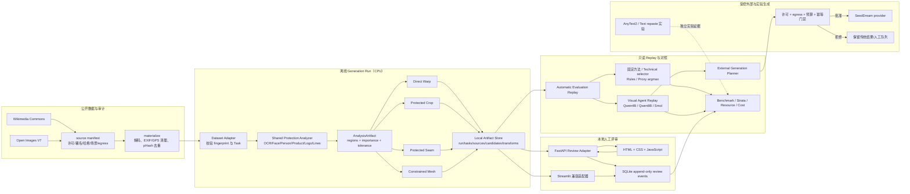
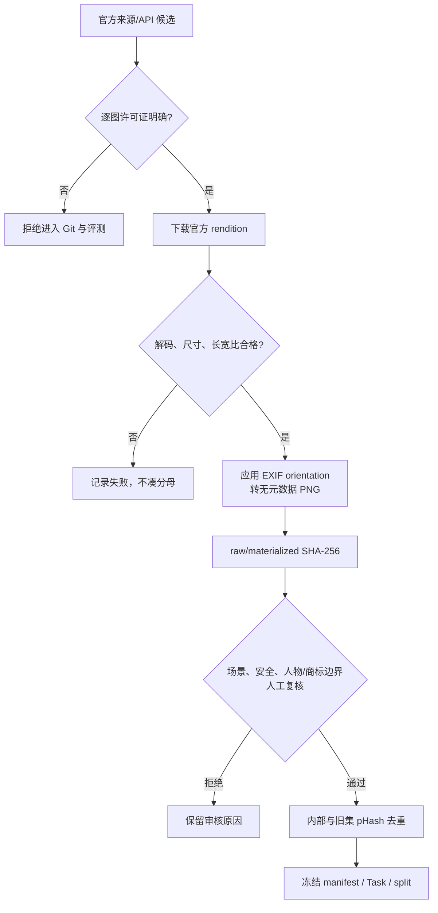
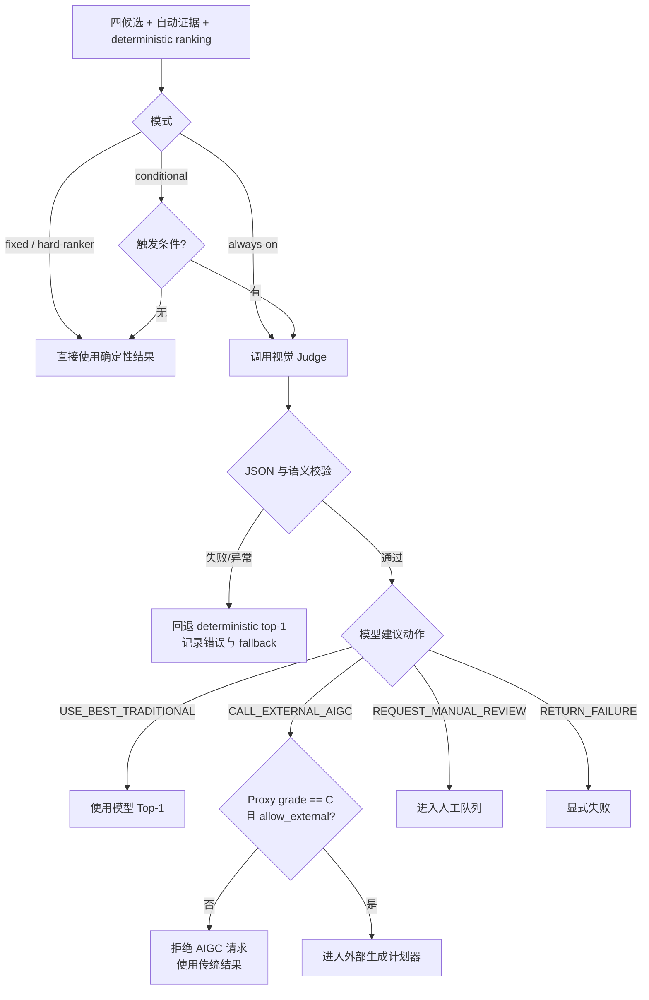
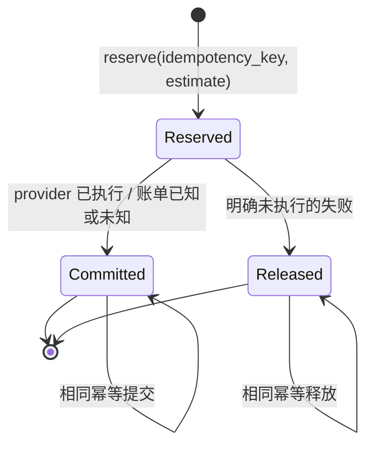
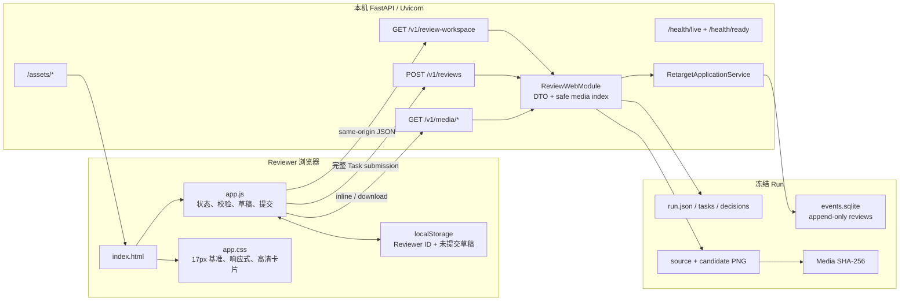
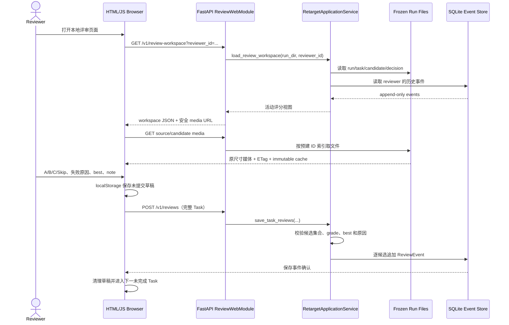

# Retarget Agent：Full300 详细技术报告与系统路线说明

> 报告日期：2026-08-12
> 评测目标：把真实世界图片重定向到 `1024 × 1024`，比较传统方法、无 Agent 路由和视觉 Agent 路由
> 数据集：`retarget_square_public_v2`，Pilot60 + 独立 Held-out240，共 300 Task
> 冻结候选：每 Task 固定 `direct_warp / crop / seam / mesh` 四张，共 1,200 张
> 最终聚合：`full300-agent-complete-v2`，18/18 arm 分母完整
> 重要限制：本文的质量分、Proxy A/B/C 和 VLM Judge 尚未用正式人工盲评标定，不能解释成线上业务通过率

本报告补充简版运行报告 `square-public-v2-full300-20260812.md`。简版回答“结果是什么”，本文回答“系统怎样运行、每条路线怎样决策、前后端怎样协作、证据怎样冻结和复现”。

## 1. 结论先行

当前推荐主路线是：

```text
共享保护分析
  → 固定生成四个传统候选
  → 自动代理评价
  → 条件触发 Qwen3-VL-4B Judge
  → 使用最佳传统候选 / 受控请求 AIGC / 请求人工 / 返回失败
```

推荐 `Qwen3-VL-4B conditional`，原因不是它参数最大，而是它在本次完整分母上取得了最好的质量、可靠性和资源平衡：

| 指标 | Qwen3-VL-4B conditional |
|---|---:|
| Task | 300/300 |
| Agent calls | 272 |
| Schema valid | 270/272 |
| 自动质量均分 | **75.305** |
| Proxy Success | **93.00%** |
| 相对后验 Proxy-argmax regret | **0.119** |
| 相比无 Agent selector 的质量增量 | **+3.672** |
| 相比无 Agent selector 的成功率增量 | **+15.00 个百分点** |

Qwen3-VL-8B 没有产生足以抵消延迟和能耗增量的质量收益；SmolVLM2 更快，但结构化响应可靠性和选图质量明显不足。外部 SeedDream 真调用为 0，不是链路缺失，而是逐图 egress、许可、预算和凭据安全门禁共同阻止了不应发生的付费调用。

## 2. 系统范围与事实边界

### 2.1 已实现且有本轮证据

- 公开图片逐图许可、来源、署名、哈希、安全和去重审核。
- 同一 `AnalysisArtifact` 驱动四种传统方法，避免方法之间使用不同保护信息。
- 四候选 Generation Run、断点恢复、单方法失败隔离、冻结配置和运行清单。
- Evaluation Replay：OCR、人脸、人物、商品、Logo 候选区域、结构线、内容保真、视觉完整、构图和资源指标。
- 无 Agent、规则、Proxy、三种视觉模型、always-on/conditional 路由对照。
- Agent 结构化 JSON 校验、最多一次修正、确定性安全回退、缓存和调用审计。
- 外部生成计划器、SeedDream provider 安全边界、预算账本与 fake HTTP 测试。
- FastAPI + 原生 HTML/CSS/JavaScript 评审网页，以及兼容的 Streamlit 评审适配器。
- 分层报告、跨 Pilot/Held-out 聚合、GPU/CPU/能耗/成本 sidecar。

### 2.2 尚未完成或不得夸大的部分

- 没有正式人工盲评，因此 Proxy Success 不是业务真实成功率。
- Logo 是需要保护的 Logo-like 区域检测，不是品牌分类器，也不承诺识别具体商标名称。
- SeedDream provider 已完成安全和契约测试，但本轮没有真实付费结果，不能宣称生成质量。
- AnyText2 只有一次受控公开图 Smoke，且文字生成失败，不能进入主路由。
- FastAPI 当前是单个冻结 Run 的本地评审服务，不是完整的多租户异步生产 Job 平台。
- 远端 Agent 服务只在 SSH 主机 loopback 临时启动，回放结束后已停止，不是常驻线上服务。

## 3. 项目级架构图



这张图中的实线表示本轮已经形成可执行代码或冻结证据的主链路；AnyText2/文字回贴仍是独立实验线，因此用虚线接入评价，而没有伪装成生产候选方法。

## 4. 核心领域对象与不可破坏的契约

| 对象 | 含义 | 关键不变量 |
|---|---|---|
| Source | 一张物化后的源图 | `source_id`、像素 SHA-256、许可来源稳定 |
| Target | 目标画布 | 本轮统一为 `1024 × 1024` |
| Task | Source → Target | `task_id = source_id__target_id`，全 Run 唯一 |
| AnalysisArtifact | 共享保护分析 | 四方法必须读取同一版本、同一配置哈希 |
| Candidate | 某方法的一次冻结输出 | 候选 ID 包含 Task、method 和配置短哈希 |
| TransformRecord | 方法实际执行的变换证据 | 记录窗口、比例、seam 数、mesh Jacobian 等风险，不等于视觉真值 |
| Generation Run | 一轮候选生成 | 数据 fingerprint、配置、代码版本、seed、依赖版本被冻结 |
| Evaluation Replay | 候选只读重评 | 不重新生成候选，不偷偷改变分母 |
| RouteDecision | 一次 Top-1 与动作选择 | 必须来自完整候选集合；Agent 失败时可审计回退 |
| ReviewEvent | 人工评分事件 | 追加写；同 reviewer/candidate 的最新事件形成活动视图 |

Generation、Evaluation、Agent Replay 和 Human Review 被分成不同目录和清单。这样能回答“图片是何时生成的”“指标是何时算的”“模型何时改选”“人工何时评分”，避免后来的评价逻辑污染早先冻结的像素。

## 5. 数据集与物化路线

### 5.1 Full300 构成

| Split | Task | 候选 | 场景 | 比例压力 |
|---|---:|---:|---|---|
| Pilot60 | 60 | 240 | 10/10/10/10/7/7/6 | hard1 40 / hard2 12 / extreme 8 |
| Held-out240 | 240 | 960 | 40/40/40/40/27/26/27 | hard1 104 / hard2 86 / extreme 50 |
| Full300 | **300** | **1,200** | 50/50/50/50/34/33/33 | hard1 144 / hard2 98 / extreme 58 |

七类场景为：中文密集文字海报、单商品宣传、多商品商业混合、多人、肖像、风景/建筑/结构线、复杂混合。来源为 266 张 Wikimedia Commons 和 34 张 Open Images V7。

### 5.2 Fail-closed 物化过程



程序化同心圆、architecture-lines、difficult-mixed 等图片只属于 `tests/fixtures`。它们可以测试算法压力和契约，但不计入 Full300 或真实 Smoke。

### 5.3 许可与出域不是同一件事

图片可公开再分发，不代表可以自动发送给第三方生成 API。manifest 分别保存：

- `redistribution_status`：能否在许可条件下再分发；
- `license_review_status`：许可证据是否已审核；
- `personality_rights_status` / `trademark_status`：非版权边界；
- `api_egress_allowed`：是否明确允许把像素发往外部模型。

Held-out240 的 `api_egress_allowed` 全部为 false，因此 Agent 请求 AIGC 也不会绕过数据政策。

## 6. 共享保护分析路线

### 6.1 输入与输出

`SharedProtectionAnalyzer` 对每个 Task 只运行一次，输出：

- 语义区域：`must_keep / prefer_keep / removable / rigid_region`；
- `importance_map`：删除或压缩该像素的代价；
- `tolerance_map`：该像素对压缩和形变的容忍度；
- analyzer ID、版本、配置哈希、warning；
- 可视化 PNG 和原始 NumPy map，便于审计。

### 6.2 检测器角色

| 检测能力 | 主要用途 | 失败时策略 |
|---|---|---|
| OCR（PPOCRv3 + 中文 CRNN） | 标题、价格、按钮、海报文字保护与字符召回 | 保存 warning；不把未识别文字当成不存在 |
| YuNet face | 人脸区域与 prominent face 回归 | detector 不可用时相应指标为 null，不填 0 |
| YOLOX person/product/object | 人物、商品和通用主体保护 | 使用计数与标签 F1；模型错误仍可能影响 Proxy |
| Logo-like region | 保护可能的 Logo/角标 | 只称候选区域，不做品牌名称识别 |
| Saliency | 无明确检测框时的主体先验 | 作为软保护，不替代对象检测 |
| Structure lines | 建筑、桥梁、文字排版直线 | 用于结构线相似度和 rigid region |

所有方法使用同一份分析，避免 Direct Warp 看见人脸而 Crop 没看见人脸这样的不公平对照。

## 7. 四条传统生成路线

### 7.1 Direct Warp

**算法**：直接把源图以 Lanczos 非等比缩放到目标宽高。

```text
sx = target_width / source_width
sy = target_height / source_height
anisotropy = max(sx / sy, sy / sx)
```

**优点**：信息零裁切、速度最快、输出尺寸确定、最适合作为完整内容基线。
**风险**：人物会变胖/变瘦，瓶体、硬币、Logo 和字体比例失真；目标比例压力越大越明显。
**审计字段**：`sx / sy / anisotropy_ratio / d_stretch`。
**Full300**：质量 71.057，Proxy Success 77.33%，总 wall 62.18s。

### 7.2 Protection-weighted Crop

**算法**：根据目标比例生成多尺度候选窗口；网格位置、图像中心、保护区域中心和人工 anchor 都可成为窗口锚点。使用 integral image 快速计算 importance 覆盖率：

```text
score = importance_coverage
        - 4.0 × cut_must_keep_count
        - 0.08 × center_distance
        - 0.05 × cropped_fraction
```

选中窗口后做等比裁切和 Lanczos resize。若没有窗口能包含全部 `must_keep`，候选状态为 `UNSAFE`，而不是静默当作成功。

**优点**：局部几何自然，hard2/extreme 的平均 Proxy Success 高于其他单方法。
**风险**：会干净地裁掉整个人、商品、多人队列、外围文案或环境语境；人脸仍在时 Proxy 可能高估主体完整性。
**审计字段**：`evaluated_windows / selected_score / window / importance_coverage / cropped_fraction / cut_must_keep_count`。
**Full300**：质量 70.287，Proxy Success 79.33%，总 wall 66.91s。

### 7.3 Protected Seam

**算法**：先做 cover resize，再用下式构造 seam energy：

```text
energy = gradient + protection_weight × importance - tolerance_weight × tolerance
```

动态规划逐条移除纵向或横向 seam。每轴最多 24 条，防止极端图消耗不可控；预算耗尽后显式做最终尺寸对齐，并写 warning。

**优点**：在温和比例变化中可绕开重要区域，减少全图统一拉伸。
**风险**：文字、脸、肢体、栏杆和建筑线可能局部弯折；大比例变化时 24 条 seam 不足，最终仍需非等比对齐。
**审计字段**：请求/实际 seam 数、穿越 importance 均值/最大值、预算是否耗尽、最终 anisotropy。
**Full300**：质量 69.639，Proxy Success 76.67%，总 wall **1,672.96s**，约为快速方法的一个数量级以上。

### 7.4 Constrained Mesh

**算法**：建立默认 `12 × 12` 轴对齐网格。每个网格段根据 importance 和 tolerance 分配目标长度，同时用 `minimum_cell_fraction=0.25` 防止单元被压到零；再通过 `cv2.remap` 双三次采样。

**优点**：可以把更多画布分给重要区域；轴对齐网格线保持直线；当前构造不会 foldover。
**风险**：重要区域之间的局部尺度不连续，人物、商品、圆形和结构会产生不均匀形变；现实现没有更强的局部刚性/ARAP 约束。
**审计字段**：网格、source/target edges、最小/最大 cell Jacobian、最大轴向 anisotropy、foldover count。
**Full300**：质量 65.844，Proxy Success 65.67%，总 wall 64.60s；当前不建议作为单独主路由。

### 7.5 单方法结论

| 方法 | 主要保留 | 主要牺牲 | 推荐角色 |
|---|---|---|---|
| Direct Warp | 全部内容 | 几何比例 | 完整信息基线 |
| Crop | 局部自然几何 | 边缘和上下文 | 内容可裁时的高价值候选 |
| Seam | 部分重要区域 | 局部连续性、时延 | 实验候选，不作默认 |
| Mesh | 按 importance 分配空间 | 局部比例一致性 | 研究候选，当前不作主路由 |

四方法不是四选一的静态产品配置。它们的价值在于提供具有不同错误模式的候选集合，让路由器能按场景选择。

## 8. 自动评价路线

### 8.1 硬检查先于分数

每张 Candidate 首先检查：文件存在、可解码、目标尺寸正确、非空白、transform 没有 mesh foldover 等。以下属于关键退化：

- OCR 源文本存在但字符召回低于关键阈值；
- 源图有高置信 prominent face，但候选未重新检测到；
- 输出尺寸、空白图或 transform 硬失败。

存在硬失败或关键退化时，Proxy 强制为 C，不允许高均值掩盖关键失败。

### 8.2 分数组成

可用分量按实际存在的权重重新归一化；缺失检测器结果保持 null，不当作 0。

```text
text = 0.65 × OCR character recall + 0.35 × OCR sequence similarity

content = weighted(
  ORB feature 0.25,
  text 0.35,
  face 0.20,
  person 0.20,
  product 0.20,
  logo 0.10,
  object-label F1 0.20
)

integrity = weighted(
  sharpness preservation 0.25,
  edge-density preservation 0.20,
  color histogram 0.15,
  structure-line similarity 0.20,
  transform safety 0.20
)

composition = 0.60 × protected-border-safety
            + 0.40 × composition-center-score

quality = 100 × (0.50 × content + 0.30 × integrity + 0.20 × composition)
```

阈值：`quality >= 80` 为 Proxy A，`>= 60` 为 Proxy B，其余为 Proxy C；任何硬失败/关键退化也强制为 C。

### 8.3 为什么还需要视觉 Agent 与人工评审

自动分数能稳定发现空白、尺寸错误、严重 OCR 缺失和部分 Crop/Mesh 问题，但仍有三类盲点：

1. 检测器只看见脸，可能高估被裁掉下半身的全身肖像；
2. 计数一致不代表几何自然，四个人都在但可能被压成细长形；
3. OCR 字符召回不等于排版可读，字符存在但可能重叠、弯曲或顺序破坏。

因此 Proxy 用作可复现排序证据，不能替代 Reviewer。

## 9. 无 Agent 对照路线

| 路线 | 输入 | 决策 | 用途 |
|---|---|---|---|
| Fixed Direct/Crop/Seam/Mesh | 冻结四候选 | 永远选指定 method | 测单方法稳定性与成本 |
| Generation technical selector | TransformRecord + 生成状态 | 按技术风险选择 | 不依赖 Evaluation 的早期基线 |
| Proxy ranker / 后验 argmax | 完整自动 metrics | 选最高 quality | 作为当前 evaluator 下的上界，不是可部署模型 |
| Rules router | hard failure、grade、score | 确定性选择/回退 | 无模型、低成本可部署对照 |

“后验 Proxy argmax”使用了完整评测分数，只能作为 evaluator 上界。它不能被写成产品路由结果，否则相当于拿答案选答案。

## 10. Agent 路线与动态选择

### 10.1 决策状态机



### 10.2 Conditional 触发条件

默认任一条件成立即调用 Agent：

- 任一候选存在 hard failure 或 critical regression；
- deterministic top score 缺失或 `< 72`；
- 前两名分差 `<= 6`；
- 仍受 `max_agent_calls` 全局预算限制。

如果没有触发 Agent，但 deterministic 候选缺失、存在关键退化或分数 `< 58`，路由器才把它视为不可靠；只有 `allow_external_aigc=true` 时才会请求外部生成，否则仍保存传统结果与风险证据。

### 10.3 Judge 输入

模型同时收到：

- 一张 source + 四候选 comparison image；
- 四候选的短别名 `C0...C3`；
- method、quality、Proxy grade、技术有效性、warning；
- OCR recall、content fidelity、visual integrity、composition；
- deterministic ranking。

长 candidate ID 不让模型从图片中复制，而由本地 alias 映射恢复，以减少 JSON 截断和 ID 幻觉。

### 10.4 Judge 输出与安全校验

vLLM 使用 structured outputs JSON Schema。输出必须满足：

- ranking 恰好是四个候选的一次排列；
- best 必须等于 ranking 第一项；
- 不得选择 hard failure；
- confidence 为 0–1；
- reason code 数量和长度有上限；
- 只有所有传统结果都为 C 且有主体/文字缺失或明显形变时才请求 AIGC。

第一次返回不合格时，后端最多用更短的 schema 指令重试一次。仍失败、HTTP 异常或本地语义验证失败时，必须确定性回退，而不是无限重试或删除 Task。

### 10.5 三种模型路线

| 模型 | 固定 revision | Full300 conditional 质量 | Success | Schema | 平均定位 |
|---|---|---:|---:|---:|---|
| Qwen3-VL-4B | `ebb281...b17` | **75.305** | **93.00%** | 270/272 | 主路线 |
| Qwen3-VL-8B | `0c351...f3b` | 74.768 | 92.33% | 271/272 | 成本更高，无明显收益 |
| SmolVLM2-2.2B | `482adb...e4` | 71.326 | 80.33% | 255/272 | 快速对照，不作主 Judge |

三种模型都分别运行 always-on 与 conditional。Pilot60 和 Held-out240 使用同样的冻结候选与 evaluator；跨轮聚合器会拒绝 arm 缺失、Task 分母不一致或 model/arm 类型不一致的报告。

### 10.6 缓存与远端执行

- cache key 包含模型版本、请求 JSON 和 comparison image 哈希；
- conditional 回放命中 always-on 成功响应时仍保留等价生产时延字段，不能把缓存读盘时间冒充真实模型时延；
- 服务只绑定远端 `127.0.0.1`，通过 SSH tunnel 访问；
- 每服务 concurrency=1、固定 revision、固定 BF16 和最大上下文；
- 回放结束后关闭服务、sampler、watchdog 与 tunnel，并复核 GPU 归零。

## 11. 外部生成与文字回贴路线

### 11.1 外部生成计划器

多个 Agent 对同一 Task 的 AIGC 请求先合并，再按风险与证据排序。Task 必须同时满足：

1. `api_egress_allowed=true`；
2. 来源属于公开真实图片；
3. 许可证已审核；
4. 未超过 `maximum_paid_calls`；
5. Provider 预算仍有余额。

Full300 的四 Agent 路由共请求 70 个唯一 Task；门禁后只有 Pilot 的 4 张公开结构图可进入计划，估计 `1.20–2.40 CNY`。本轮实际付费调用为 0。

### 11.2 SeedDream provider

Provider 已实现的安全边界：

- endpoint、key、model 只从运行时参数/环境变量读取，不写入代码或 manifest；
- 只接受 HTTPS，拒绝 localhost、私网、保留地址和重定向逃逸；
- 请求前检查 public-source、egress 和预算；
- 每 Task 只允许单输出，source hash、目标、模型、prompt、generation config 进入幂等键；
- 请求前写 durable pending cache，并使用跨进程 claim 防止双重计费；
- 5xx/timeout 因账单未知而保守 commit estimate，不把未知 actual 当 0；
- 4xx 明确未执行时释放 reservation；
- 下载检查 MIME、Content-Length、流式大小、解码、方形尺寸与像素；
- 原子落盘并保存 SHA-256；不自动重试付费请求。

本轮没有使用曾出现在工具日志中的 key；它应视为已泄露并轮换。

### 11.3 AnyText2

单张公开 1024² Smoke：30 steps，纯采样 13.88s，冷启动 58.81s，峰值显存 11,373MiB。目标文字 OCR 召回和序列相似度均为 0，遮罩外也有明显扰动，因此技术执行成功但业务质量失败，不进入主路由。

### 11.4 自研文字回贴

`text_repaste.py` 支持两种合成：

- `foreground_alpha`：用局部对比、Canny edge、膨胀/闭运算和 blur 构造前景 alpha；
- `opaque_patch`：直接回贴完整 patch。

它记录 pasted region、像素占比、跳过区域和 warning。单区实验很快，但仍有底层文字残片和拼接边界；当前定位是可测实验模块，不是已验证生产工作流。

## 12. 成本与资源路线

### 12.1 统一归属

成本条目可归属到 Task、Candidate、Agent call 或 Workflow，并区分 direct、infrastructure、operations。`actual_amount` 未知时保持 null；只有完整 actual 才报告 actual total，否则使用完整 estimate 并明确 `cost_basis=estimated`。

### 12.2 硬预算状态机



未知 actual 的 committed 记录继续按 estimate 占用预算；这避免 timeout 后再次发请求造成双重计费。

### 12.3 GPU 实测

| 模型窗口 | Active GPU | Active Wh | Window Wh | 峰值显存 | 5 CNY/GPUh 情景 |
|---|---:|---:|---:|---:|---:|
| Qwen3-VL-4B | 1,011.18s | **73.16Wh** | 128.84Wh | 19,711MiB | **1.4044 CNY** |
| Qwen3-VL-8B | 1,350.24s | 112.64Wh | 164.54Wh | 19,747MiB | 1.8753 CNY |
| SmolVLM2 v1+v2 | 907.15s | 55.37Wh | 104.90Wh | 22,249MiB | 1.2599 CNY |

Qwen Held-out 观测窗口包含启动、always 和缓存式 conditional，Smol 还包含唯一 v2 重试，因此报告保留 capture scope，不把混合窗口伪装成隔离的每臂账单。

## 13. 前端、后端与持久化架构

### 13.1 部署视图



### 13.2 页面加载和保存时序



### 13.3 FastAPI 接口

| Endpoint | 作用 | 安全边界 |
|---|---|---|
| `GET /` | 返回静态评审页面 | 不动态拼 HTML |
| `GET /health/live` | 进程活性 | 不读取私有内容 |
| `GET /health/ready` | Run/媒体完整性 | 报 missing 数，不泄露绝对路径 |
| `GET /v1/review-workspace` | Reviewer 的任务与活动评分视图 | reviewer ID 严格校验 |
| `POST /v1/reviews` | 保存完整 Task 的候选评分 | Pydantic `extra=forbid`，服务层重校验 |
| `GET /v1/media/sources/{task_id}` | 原图 inline/download | ID 必须已在 Run 索引，不接受任意路径 |
| `GET /v1/media/candidates/{candidate_id}` | 候选 inline/download | 同上；ETag 使用冻结 SHA |
| `GET /api/docs` | 本地 OpenAPI | 便于审查 DTO |

媒体接口不是“把 URL 拼成文件路径”。应用启动时只从冻结 manifest 建立 `resource_id → MediaRecord` 映射，未知 ID 返回 404；因此 `..` 或绝对路径不能逃出 Run。

### 13.4 前端交互

- 根字号 17px，微软/苹方/Noto CJK 字体栈；移动端 16px；标题使用响应式 `clamp`。
- 原图和 Technical Top-1 并排，只把 Top-1 标成未校准参考，不作为标准答案。
- 四候选使用 2×2 大卡片；原图可全屏 modal 和下载原始 PNG。
- Reviewer 必须先给每张 A/B/C/Skip；C 必须选择失败原因；best 只能从 A/B 中选择且最多一个。
- 每次字段变化都写入按 `run + reviewer + task` 隔离的 localStorage 草稿。
- 保存按钮在评分缺失、C 无原因、best 非 A/B 或多个 best 时禁用。
- 页面提交完整 Task，而不是边点边写半条记录；后端仍逐候选追加事件。
- 响应式断点覆盖宽屏、平板和手机；支持键盘焦点、skip link、Escape 关闭全屏和 reduced-motion。

### 13.5 HTTP 与浏览器安全

后端设置：

- CSP：默认、图片、样式和脚本仅允许 same-origin；禁止 object、base URI 和 frame；
- `Referrer-Policy: no-referrer`；
- `X-Frame-Options: DENY`；
- `X-Content-Type-Options: nosniff`；
- 媒体 `Cache-Control: private, immutable` 和 SHA ETag。

服务默认绑定 `127.0.0.1:8765`。它没有账号体系或公网鉴权，因此不应直接绑定公网地址。

### 13.6 Streamlit 兼容路线

Streamlit 和 FastAPI 都只调用 `RetargetApplicationService`，不复制评分规则。Streamlit 提供相同的 A/B/C/Skip、失败原因、best、进度与断点能力；FastAPI 网页是更适合大字号、全屏原图、精细响应式布局和后续前后端分离的主评审界面。

## 14. 代码模块地图

| 模块 | 责任 |
|---|---|
| `datasets.py` | CSV/folder 数据集校验、Task 与 fingerprint |
| `analysis.py` / `protection_detectors.py` | 共享保护区域与 importance/tolerance map |
| `methods/*` | 四个 `CandidateMethod` 实现 |
| `runner.py` | Generation 状态、恢复、失败隔离、候选冻结 |
| `evaluation.py` | 自动指标与 Evaluation Replay |
| `agents.py` | 条件触发、视觉 Judge、Schema、回退、缓存 |
| `generation_planning.py` | 多 Agent AIGC 请求合并与逐图政策门禁 |
| `providers/seedream.py` | 付费 provider、SSRF/预算/幂等/下载验证 |
| `text_repaste.py` | 独立文字回贴实验模块 |
| `benchmarking.py` | 每个 arm 完整性和核心指标 |
| `stratified_reporting.py` | scene × difficulty 分层 |
| `resource_cost_reporting.py` | 资源观测和成本 sidecar |
| `round_aggregation.py` | Pilot/Held-out 严格跨轮聚合 |
| `review.py` / `events.py` | 评分领域规则与追加事件 |
| `web_app.py` / `web/*` | FastAPI DTO、媒体边界与浏览器前端 |
| `streamlit_app.py` | Streamlit 兼容评审适配器 |
| `service.py` | CLI、Streamlit、FastAPI 共用应用服务面 |
| `cli.py` | validate/generate/evaluate/agent/benchmark/review 命令入口 |

## 15. Run 目录与证据链

```text
runs/<run-id>/
├── run.json                         # Run 状态与不可变量
├── config/run.yaml                  # 配置快照
├── tasks/<task-id>.json             # 冻结 Task
├── sources/<source-id>.png          # 冻结像素
├── analysis/<task-id>/              # regions/maps/previews
├── candidates/<task-id>/<method>/
│   ├── candidate.png
│   ├── candidate.json
│   └── transform.json
├── decisions/<task-id>.json         # Generation technical selector
├── evaluations/<evaluation-id>/     # 只读自动指标
├── agent-runs/<agent-run-id>/       # calls/decisions/manifest
├── generation-plans/<plan-id>/      # 付费候选门禁结果
├── benchmarks/<benchmark-id>/       # 报告与 CSV
├── resource-observations/            # GPU sampler 与 scope
└── events.sqlite                    # stage/review 追加事件
```

相同 `run_id` 如果配置哈希或 dataset fingerprint 不同会被拒绝；已存在候选会按记录恢复，不重复生成；新 Evaluation/Agent/Benchmark 必须使用新 ID，不能覆盖旧证据。

## 16. Full300 结果总表

### 16.1 传统方法

| 方法 | 质量均分 | Proxy Success | 总 wall | 总 CPU | 5 CNY/CPUh 情景 |
|---|---:|---:|---:|---:|---:|
| direct_warp | **71.057** | 77.33% | **62.18s** | **70.56s** | **0.0980 CNY** |
| crop | 70.287 | **79.33%** | 66.91s | 75.48s | 0.1048 CNY |
| seam | 69.639 | 76.67% | 1,672.96s | 1,909.14s | 2.6516 CNY |
| mesh | 65.844 | 65.67% | 64.60s | 77.22s | 0.1072 CNY |

### 16.2 路由路线

| 路线 | Calls | Schema | 质量 | Success | Regret | p50/p95 |
|---|---:|---:|---:|---:|---:|---:|
| 后验 Proxy argmax | 0 | n/a | **75.424** | 92.67% | 0.000 | n/a |
| 无 Agent selector | 0 | n/a | 71.633 | 78.00% | 3.791 | n/a |
| Rules / Proxy router | 0 | n/a | 73.701 | 86.00% | 1.723 | n/a |
| Qwen4B always | 300 | 298/300 | **75.327** | **93.00%** | **0.097** | 6.125/13.481s |
| **Qwen4B conditional** | **272** | **270/272** | **75.305** | **93.00%** | **0.119** | 6.154/13.497s |
| Qwen8B conditional | 272 | 271/272 | 74.768 | 92.33% | 0.656 | 7.493/10.866s |
| Smol conditional v2 | 272 | 255/272 | 71.326 | 80.33% | 4.097 | 4.323/7.798s |

Conditional 4B 相比 always-on 少 28 次调用，结果几乎不变，是当前最合理的默认值。下一步优化应优先减少不必要调用、修正裁切完整性代理和补正式人工标定，而不是直接扩大 VLM 参数。

## 17. 代表图与错误模式

本地扩展交付包包含 28 个代表 Task：每类场景 4 个，分别覆盖最低最佳分、方法差异最大、极端/中位难例和 Qwen4B 改选收益最大。每 Task 目录含原图、四张独立 1024² PNG、分数排名、Agent 选择、transform、来源和文字评分原因。

视觉复核发现：

- 肖像 Crop 经常因保留脸部而高分，但删除全身姿态；
- 宽幅多人图的全内容方法会把所有人压瘦，计数仍可能完全保留；
- 海报 Crop 会放大局部文字，却删除底部条款、价格或 Logo；
- 多商品 Crop 可能只留下一个商品，使局部构图更自然但任务语义改变；
- 桥梁和商场结构中，Crop 与全内容形变之间没有天然无损答案；
- 硬币、瓶子等刚性/圆形商品最容易暴露 Direct、Seam 和 Mesh 的比例问题。

这些案例解释了为什么推荐“多候选 + 条件 Judge”，而不是把某个传统方法固定成唯一输出。

## 18. 复现、验证与启动

### 18.1 环境与测试

```powershell
.\.venv\Scripts\ruff.exe check src tests scripts
.\.venv\Scripts\python.exe -m pytest -q
```

本轮最后一次完整验证：Ruff PASS，`142 passed in 26.41s`；Held-out audit 为 `960/960` 候选、哈希、尺寸和 transform 完整，240/240 Task 均有共享分析与四方法组。

### 18.2 数据物化

```powershell
.\.venv\Scripts\python.exe scripts\materialize_square_public_v2.py --help
```

脚本保留候选发现、下载失败、逐图审核、split 冻结、物化和验证的独立命令。Git 只保存脚本、manifest、来源审计和说明；像素位于被忽略的数据目录。

### 18.3 生成与评价

```powershell
retarget-agent validate datasets\retarget_square_public_v2
retarget-agent generate configs\square_public_v2_pilot60.yaml
retarget-agent evaluate runs\<run-id> --evaluation-id <new-evaluation-id>
retarget-agent agent runs\<run-id> --evaluation-id <evaluation-id> `
  --agent-run-id <new-agent-run-id> --mode conditional_agent `
  --backend-url http://127.0.0.1:<tunnel-port> --model-version qwen3vl-4b
```

远端模型服务必须由操作者独立启动并用 SSH tunnel 映射到本机 loopback；不要把未鉴权的 vLLM 端口暴露到公网。

### 18.4 启动 FastAPI 评审网页

```powershell
retarget-agent review web runs\<completed-run-id> --host 127.0.0.1 --port 8765
```

浏览器打开 `http://127.0.0.1:8765`。API 文档位于 `/api/docs`。旧 Streamlit 适配器：

```powershell
retarget-agent review ui runs\<completed-run-id>
```

### 18.5 跨轮聚合

```powershell
.\.venv\Scripts\python.exe scripts\aggregate_benchmark_rounds.py `
  --spec configs\full300_benchmark_aggregation_v2.json `
  --output-dir runs\full300-square-public-v2-20260812\benchmarks `
  --report-id <new-report-id>
```

聚合器不会从 round p50/p95 猜 full p50/p95；没有原始样本时这些字段保持 null，并在 notes 中说明不可重构。

## 19. 当前里程碑与下一步

| 项目 | 当前状态 | 下一步 |
|---|---|---|
| M0–M4 | 完成 | 不重复建设核心契约、四方法和评审 UI |
| M5 自动评价 | 完成可回放版本 | 用正式 Reviewer 数据校准阈值与 Bad Pass |
| M6 人工标定 | 按要求暂缓 | 后续做盲评、交叉 Reviewer 一致性 |
| M7 Judge Agent | 三模型完整对照完成 | 固化 4B conditional，优化触发率和 Prompt |
| M8 外部生成 | Adapter/计划/测试完成，真实质量未验证 | 轮换 key 后只跑冻结 4-call Pilot |
| M8 文字回贴 | 实验可测，质量未通过 | 改善背景清理、字形和融合边界 |
| M9 服务 | 本地完整评审前后端 | 增加异步 Job、取消、结果 API 和生产鉴权 |

优先级建议：

1. 先用 28 个代表 Task 和分层抽样建立正式人工盲评；
2. 用人工 Bad Pass 校准“全身被裁但脸在”的 Proxy 漏洞；
3. 固化 Qwen4B conditional，继续降低 272/300 的触发率；
4. 轮换 SeedDream key 后只执行冻结 4-call，不扩大预算；
5. 只有真实生成质量通过后，才把 AIGC Candidate 合并进统一 Benchmark；
6. 最后再做 M9 异步生产 Job，而不是把当前本地 Review API 宣称为生产平台。

## 20. 最终事实清单

- 300/300 真实公开 Task，1,200/1,200 传统候选，18/18 arm 完整。
- 推荐 Qwen3-VL-4B conditional；不是 8B，也不是 Smol。
- SeedDream 实际调用 0、实际付费 0；计划成本与实际成本分开记录。
- AnyText2 单图执行成功但文字质量失败；文字回贴仍为实验。
- 前端、FastAPI、Streamlit 共用服务层；媒体只能按冻结 ID 读取。
- 运行像素、模型权重、密钥、远端地址和本地缓存不进入 Git。
- 本报告给出的是可重复的工程与自动评价证据，不冒充正式人工业务结论。
